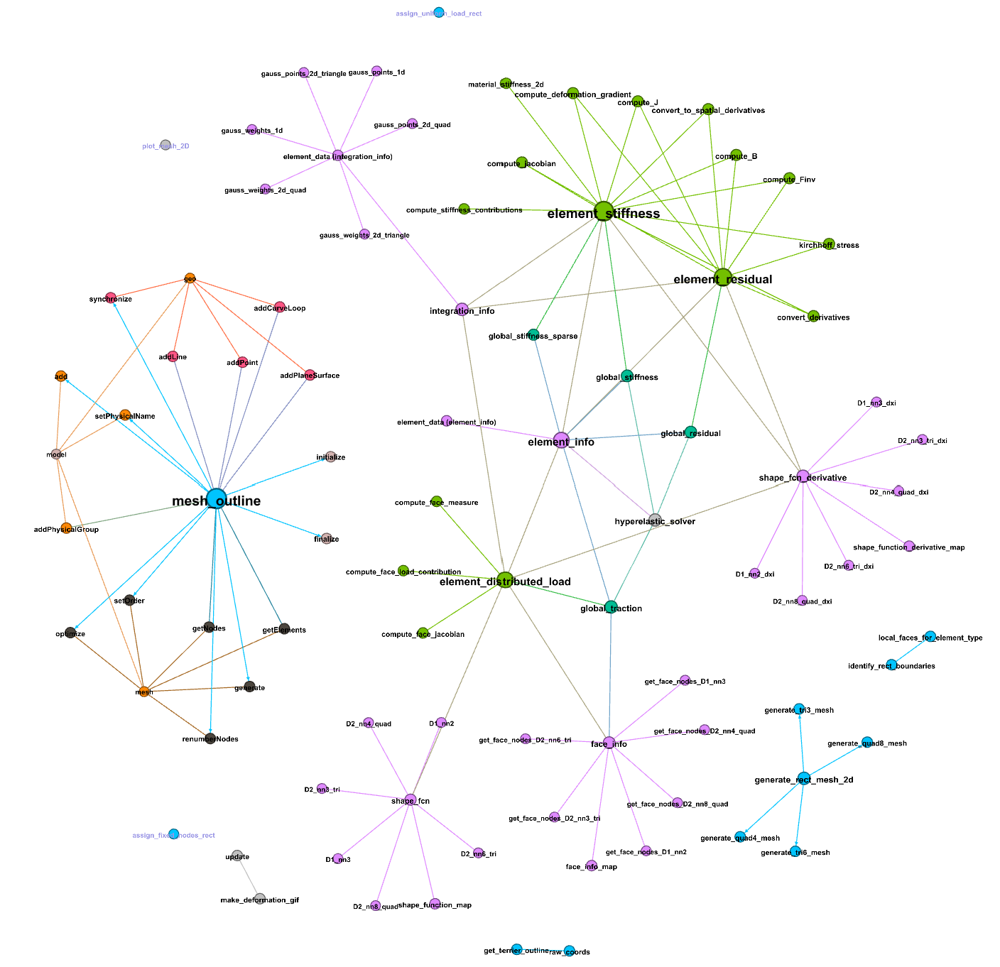
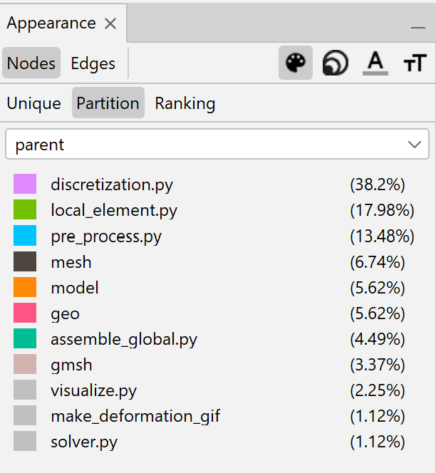

Please see the code analysis excel workbook for information used to create a network graph of the finiteelementanalysis package using Gephi.

Directed edges represent calls without returns, while return values are expected for calls represented by undirected edges.

Each node is colored according to the module it belongs to, and each edge is given the source node's color.

The size of each node is determined by its weighted degree.

